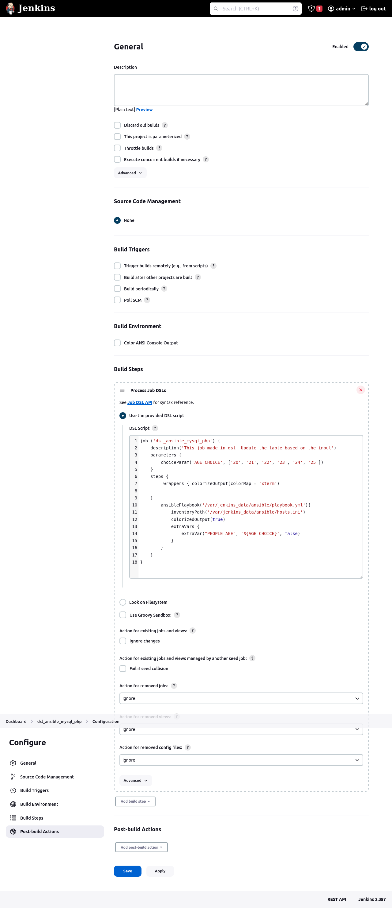

**_Description:_**
Create Job in Jenkins with DSL API.
In Jenkins, select the age of the people, after that the Ansible playbook will be launched. Using Ansible, the data will be entered into index.php, and a selection of people with the specified age will be made from the database. Their names will be displayed on the web page http://ip_of_nginx_server:port/index.php


## 1. Create an SSH-key

- in the folder "docker_centos7" run:

```bash
ssh-keygen -f id_rsa
```

- copy private key to the folder docker_jenkins:

```bash
cp id_rsa ../jenkins_data/ansible/id_rsa

```

## 2. Building Docker images and containers

- install Docker and Docker Compose - run [script](install_docker.sh)
- run building images

```bash
docker-compose up -d
```

## 3. Connect from Jenkins to Centos using copied SSH-key (public key was downloaded to Centos during creating Docker image)

```bash
docker container exec -it jenkins_container bash
ssh -i /var/jenkins_data/ansible/id_rsa centos_user@centos_container
```

## 4. Create database and table with customers

- Copy [file with random names](docker_mysql/add_customers.sh) and [script](docker_mysql/add_customers.sh) to container with MySQL

  ```
  docker container cp docker_mysql/. mysql_container:/tmp/
  ```

- connect to container with MySQL from local computer and run script:

  ```
  docker container exec -it mysql_container bash
  cd /tmp
  chmod +x add_customers.sh
  ./add_customers.sh
  ```

  docker container exec -it web_container bash

## 5. In Jenkins

- In log find password to Jenkins GUI:

  ```
  docker logs -f jenkins_container
  ```

- Install plugins: Ansible, AnsiColor, Job DSL

- Copy code from [this file](dsl_job.j2) and create new Freestyle project
  

  - after first start can show error:

  

  it can be fixed if approve run this script (Manage Jenkins ==> In-process Script Approval)

  
