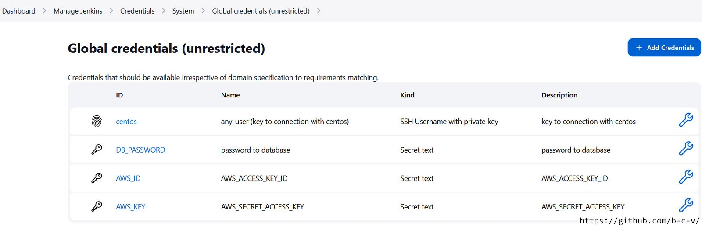
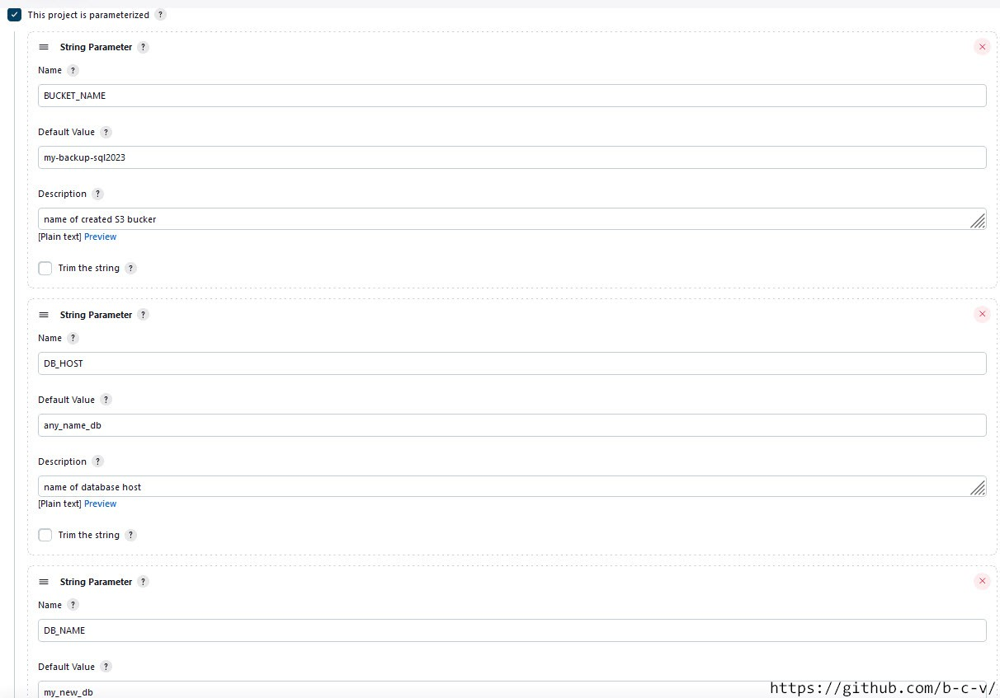
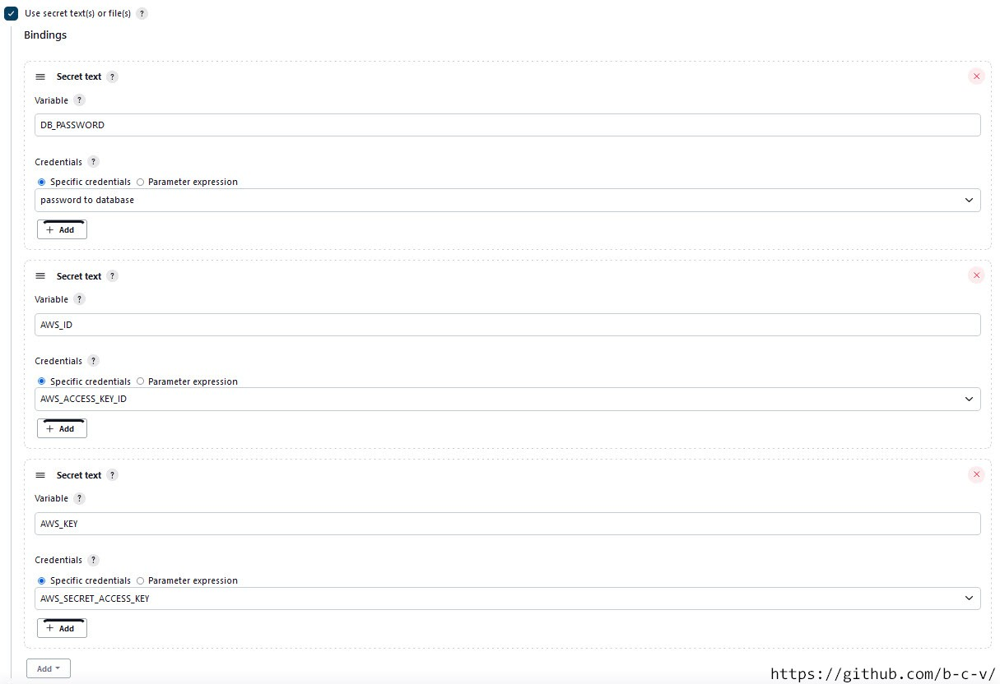
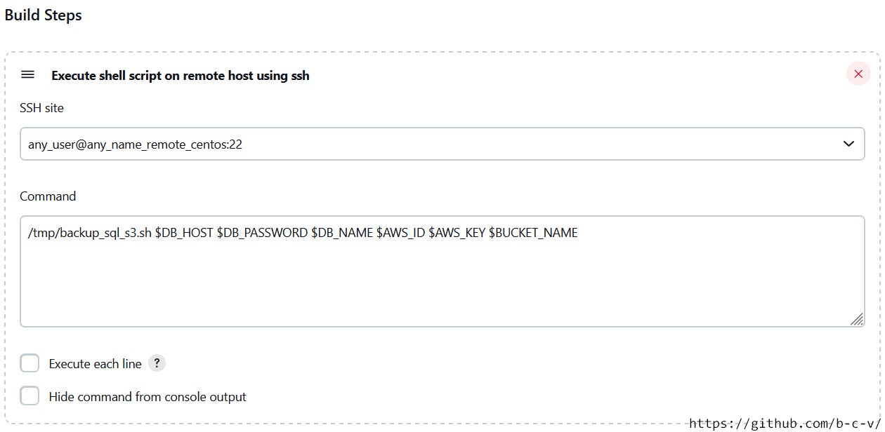

**_Description:_**
Copy backup of database to AWS S3 bucket. Create three Docker containers (Jenkins, Centos and MySQL).

## 1. Create an SSH-key in the "dir_centos" folder by running the command:

```bash
ssh-keygen -f id_rsa
```

## 2. Change owner of the folder "jenkins_home" to current user:

2.1 Find out the ID number of the current user

```bash
id
```

2.2 Change owner

```bash
chown id:id jenkins_home
```

## 3. Run building

```bash
docker-compose up -d
```

## 4. Copy private SSH-key to container with Jenkins (public key was downloaded to Centos during creating Docker image)

- From local server copy created in p.1 private SSH-key

```bash
docker container cp dir_centos7/id_rsa any_name_remote_jenkins:/tmp/id_rsa
```

- Connect from Jenkins using copied SSH-key

```bash
docker container exec -it any_name_remote_jenkins bash
ssh -i /tmp/id_rsa any_user@any_name_remote_centos
```

## 5. In Jenkins

- Install plugin SSH
- Add credentials to connect to remote host Centos (Manage Jenkins ==> Manage Credentials ==> global). Username: any_user; Private Key: copy value of public key from p.1
- Add remote host (Manage Jenkins ==> Configure System ==> SSH remote hosts). Hostname: any_name_remote_centos; Port: 22; Credentials: look p.4

## 6. Connect to MySQL database from local computer:

- connect to container with MySQL:
  ```
  docker container exec -it any_name_remote_db bash
  ```
- connect to DB

  ```
  mysql -u root -h any_name_db -p
  ```

```sql
  show databases;
  create database my_new_db;
  use my_new_db;

  CREATE TABLE Persons (
    PersonID int,
    LastName varchar(255),
    FirstName varchar(255),
    Address varchar(255),
    City varchar(255)
);

INSERT INTO Persons (PersonID, LastName, FirstName, Address, City) VALUES (1, 'DevOps', 'Sergey', 'Ukraine', 'Kiev');
INSERT INTO Persons (PersonID, LastName, FirstName, Address, City) VALUES (1, 'DevOps', 'Sergii', 'Poland', 'Bydgoszcz');
```

## 7. In AWS:

- create S3 bucket with name "my-backup-sql2023"
- create user with credential to connect with CLI

## 8. Getting the backup job done with manual configuration

8.1. Create a backup of DB and copy it to S3 bucket

- Connect to Centos from local computer

```
docker container exec -it any_name_remote_centos bash
mysqldump -u root -p -h any_name_db -p my_new_db > /tmp/backup.sql
```

- Add credentials to connect to AWS

```
export AWS_ACCESS_KEY_ID=xxxxxxxxx
export AWS_SECRET_ACCESS_KEY=xxxxxxx

```

- Copy backup to S3 bucket

```
aws s3 cp /tmp/backup.sql s3://my-backup-sql2023/backup.sql
```

## 9. Getting the job with Jenkins and Bash scripts

Jenkins:

9.1 copy file Docker-Jenkins-SSH-MySQL-AWS/backup_sql_s3.sh to container with Centos

```
docker container cp backup_sql_s3.sh any_name_remote_centos:/tmp/backup_sql_s3.sh
```

9.1 add credentials Kind: Secret text (Manage Jenkins ==> Credentials ==> (global)) for:

- password to database (DB_PASSWORD is the name of variable in the script backup_sql_s3.sh)
- AWS_ACCESS_KEY_ID (AWS_ID)
- AWS_SECRET_ACCESS_KEY (AWS_KEY)



9.2 Create new job (New item ==> Freestyle Project) or import from file aws_backup.xml

```
java -jar jenkins-cli.jar -s http://localhost:8080/ -auth admin:***token*** -webSocket create-job aws_backup <  aws_backup.xml
```





Command: /tmp/backup_sql_s3.sh $DB_HOST $DB_PASSWORD $DB_NAME $AWS_ID $AWS_KEY $BUCKET_NAME
